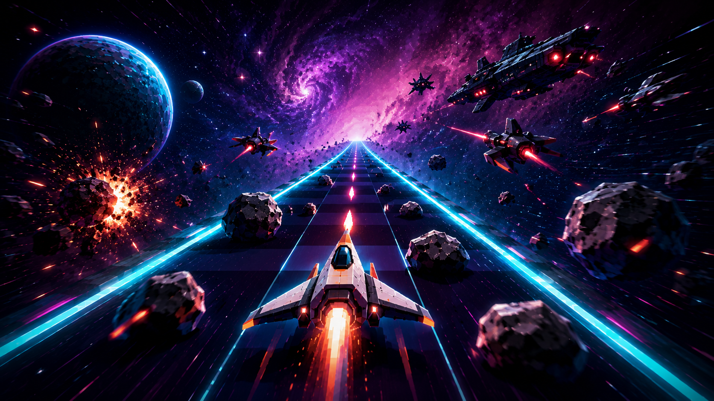

# COSMODROME
### *an endless drift through the dark*
<p align="center">
  <a href="https://hassanireza.github.io/CosmoDrome/">
    
  </a>
</p>
> A nostalgic, pseudo-3D endless space racer built entirely in plain JavaScript - no engine, no dependencies, no build step.

---

## Table of Contents

1. [Overview](#overview)
2. [Features](#features)
3. [Getting Started](#getting-started)
4. [Controls](#controls)
5. [Gameplay](#gameplay)
6. [Weapons](#weapons)
7. [Enemies & Obstacles](#enemies--obstacles)
8. [Boss Encounters](#boss-encounters)
9. [Scoring & Progression](#scoring--progression)
10. [Visual & Audio Design](#visual--audio-design)
11. [Architecture](#architecture)
12. [File Structure](#file-structure)
13. [Testing](#testing)
14. [Browser Support](#browser-support)
15. [License](#license)

---

## Overview

Cosmodrome is a browser-based, retro-style endless racer inspired by classic arcade games like *Enduro*. You pilot a starfighter down an infinitely curving corridor of deep space, dodging asteroid fields, blasting raider scouts, hopping debris stones, and squaring off against sector bosses every five sectors.

The entire game - physics, rendering, audio, collision detection, and state management - is hand-written in vanilla JavaScript across two files totalling fewer than 2,500 lines. There are no third-party libraries, no bundler, and no game engine.

---

## Features

- **Pseudo-3D perspective renderer** - a classic focal-length projection gives the illusion of depth on a flat 2D canvas.
- **Endless procedural corridor** - the track curves smoothly and continuously, with difficulty scaling as you survive longer.
- **Four selectable weapons** - each with distinct fire patterns, heat management, and damage profiles.
- **Four enemy types** - with sector-gated spawn weights that escalate as you progress.
- **Four unique sector bosses** - cycling every fifth sector with increasing HP, each with its own movement and firing pattern.
- **Combo multiplier system** - chain overtakes and kills for higher scores.
- **Extra lives** - earned at score milestones, capped at six hull segments.
- **Synthesized chiptune audio** - all sound effects are generated at runtime via the Web Audio API; no audio files are bundled.
- **Five dynamic colour palettes** - the visual theme rotates each sector, from *Indigo Void* to *Violet Storm*.
- **Persistent leaderboard** - top five scores saved to `localStorage`, shown at game start and game over.
- **Full touch support** - on-screen buttons for mobile and tablet play.
- **Accessibility** - ARIA labels on all interactive elements and live regions for score updates.
- **Retina / HiDPI rendering** - canvas scales to `devicePixelRatio` (capped at 2×).
- **Auto-pause on tab switch** - the game pauses when the browser tab loses visibility.

---

## Getting Started

Cosmodrome requires no installation and has no dependencies.

```bash
git clone https://github.com/your-username/cosmodrome.git
cd cosmodrome
```

Open `index.html` directly in any modern browser:

```bash
# macOS
open index.html

# Linux
xdg-open index.html

# Windows
start index.html
```

Or serve it with any static file server if you prefer to avoid `file://` restrictions:

```bash
npx serve .
# or
python3 -m http.server 8080
```

Then navigate to `http://localhost:8080`.

> **No build step required.** There is no `package.json`, no bundler, and no transpilation. The game runs as-is.

---

## Controls

### Keyboard

| Key | Action |
|---|---|
| `←` / `A` | Steer left |
| `→` / `D` | Steer right |
| `↑` / `W` | Thrust (increase speed) |
| `↓` / `S` | Brake (reduce speed) |
| `Space` | Hop (jump over stones) |
| `Q` | Cycle weapon |
| `1` / `2` / `3` / `4` | Select weapon directly |
| `P` / `Escape` | Pause / resume |
| `Enter` | Start / restart / resume |

### Touch (mobile & tablet)

On-screen buttons appear at the bottom of the screen:

| Button | Action |
|---|---|
| `◀` | Steer left |
| `▶` | Steer right |
| `▲` | Hop |
| `⚙` | Cycle weapon |

The weapon can also be changed via the dropdown selector in the HUD.

---

## Gameplay

### The Corridor

Your starfighter moves automatically down an infinitely curving tunnel of space. The corridor bends left and right using smooth exponential curves - you must steer against centrifugal drift to stay centred. Speed increases continuously from a base of 480 units/sec up to 2,100 units/sec, governed by a time-constant ramp over roughly 24 seconds of play.

### Sectors

The run is divided into **sectors**. Each sector requires you to overtake or destroy a set number of obstacles to progress - the quota starts at 14 and grows by 5 per sector. A progress bar in the top HUD shows how far through the current sector you are. Completing a sector triggers a speed bump and rotates the colour palette.

### Hull Integrity (Lives)

You start with **3 hull segments**. Taking a hit from an asteroid, raider bolt, or boss attack removes one segment and grants a brief invulnerability window (1.3 seconds). Reaching 0 segments ends the run.

You earn an **extra hull segment** every 4,000 points, up to a maximum of 6.

### Hop

Press `Space` (or the `▲` touch button) to hop over **stones** - low debris that cannot be shot. The hop has a short cooldown and a precise timing window; a perfectly-timed hop also awards a small score bonus.

### Combo

Overtaking or destroying obstacles in quick succession builds a **combo multiplier** (shown in the centre of the screen). The multiplier decays if you go too long without a score event, so aggressive play is rewarded.

---

## Weapons

Your starfighter auto-fires continuously. All weapons share a **heat** system: firing builds heat, and overheating pauses fire until the weapon cools. You can switch weapons at any time without penalty.

| Weapon | Key | Bolts | Damage | Fire Rate | Heat/Shot | Notes |
|---|---|---|---|---|---|---|
| **Pulse Laser** | `1` | 1 | 1 | Fast | Low | Default; reliable single shot |
| **Twin Cannon** | `2` | 2 | 1 ea. | Medium | Medium | Two parallel bolts; wide coverage |
| **Spread Blaster** | `3` | 3 | 1 ea. | Slow | High | Fan pattern; good for clusters |
| **Homing Missile** | `4` | 1 | 3 | Very slow | Very high | Locks onto nearest enemy; high DPS |

---

## Enemies & Obstacles

Four object types populate the corridor. Spawn weights shift as sectors advance, making later runs substantially more dangerous.

| Type | HP | Points | Behaviour | Appears from |
|---|---|---|---|---|
| **Asteroid** | 2 | 25 | Drifts in a fixed lane | Sector 1 |
| **Stone** | 1 | - | Cannot be shot; must be hopped | Sector 1 |
| **Raider Scout** | 2 | 45 | Weaves laterally; fires back | Sector 2 |
| **Wreck** | 3 | 60 | Slow, heavily armoured hulk | Sector 3 |

Raider scouts and wrecks fire **enemy bolts** toward the player. Enemy bolts travel in the opposite direction to player fire and are tracked in a separate pool to avoid collision cross-contamination.

---

## Boss Encounters

Every **fifth sector** a capital-ship boss spawns, announced by a dramatic intro card. Bosses have unique HP pools, movement routines, and firing patterns. They cycle through four archetypes - on repeat visits the same archetype returns with more HP.

| Boss | HP (cycle 1) | Movement | Fire Pattern |
|---|---|---|---|
| **Render Hulk** | 26 | Slow weave | Spread volley |
| **Vanguard Striker** | 18 | Fast dart / lane-hunt | Rapid aimed singles |
| **Twin Sentinel** | 30 | Stationary hold | Alternating twin turrets |
| **Swarm Mother** | 24 | Slow drift | Tracking beam |

A dedicated boss health bar appears in the HUD during the fight. Defeating a boss awards **1,200 bonus points** and triggers a sector transition.

---

## Scoring & Progression

| Event | Points |
|---|---|
| Pass asteroid / stone | 25 |
| Destroy asteroid | 25 |
| Destroy raider scout | 45 |
| Destroy wreck | 60 |
| Defeat sector boss | 1,200 |
| Perfect hop timing | Bonus (varies) |

Points are multiplied by the current **combo multiplier**. The top five scores are stored in `localStorage` under the key `cosmodrome_scores_v1` and displayed on the start and game-over screens.

---

## Visual & Audio Design

### Colour Palettes

The game cycles through five palette themes, one per sector:

| Palette | Rail Colour | Mood |
|---|---|---|
| Indigo Void | Cyan `#5dd9e8` | Cold deep space |
| Crimson Nebula | Orange `#ff8c3d` | Danger zone |
| Emerald Drift | Mint `#5dffb0` | Alien territory |
| Amber Dust | Gold `#ffd166` | Ancient debris field |
| Violet Storm | Red `#ff4d5e` | Boss sector |

### Typography

- **Press Start 2P** - pixel display font for titles and the main HUD.
- **Quicksand** - rounded sans-serif for body text and card copy.
- **JetBrains Mono** - monospaced font for numeric readouts.

### Audio

All sound effects are synthesised on the fly using the **Web Audio API** (`OscillatorNode` and `AudioBufferSourceNode`). No audio files are loaded. Effects include laser fire, cannon blasts, missile launches, small and large explosions, hull damage, sector clears, extra life pickups, and game over. Audio can be muted via the `SOUND ON / OFF` toggle and the preference is persisted in `localStorage`.

---

## Architecture

The codebase is split into two JavaScript files with a clean dependency boundary:

### `physics.js`

A pure, side-effect-free math module. Contains every formula the game engine relies on:

- `clamp`, `lerp`, `approach` - general utilities
- `speedAtTime` - exponential speed ramp over elapsed play time
- `projectScale` - focal-length perspective projection (pseudo-3D)
- `laneToX` - converts a normalised lane position to a screen-space X coordinate, accounting for curve offset
- `steerVelocity` - direct acceleration/deceleration steering model (no exponential lag)
- `spawnInterval` - obstacle spawn rate ramp
- `sectorQuota` - per-sector overtake quota
- `overlap1D` - 1D interval collision test for lateral hit detection

This file has **zero DOM references** and **zero globals** beyond `Math` and `Date`. It runs identically in the browser and in Node.js, enabling headless unit testing.

### `game.js`

The main game engine. Structured as a self-executing IIFE to avoid polluting the global scope. Responsibilities:

- **Configuration** - all tunable constants in a single `CFG` object at the top of the file.
- **State machine** - six states: `START`, `PLAYING`, `BOSSINTRO`, `BOSS`, `PAUSED`, `GAMEOVER`.
- **Object pools** - pre-allocated arrays for obstacles (40 slots), particles (140 slots), player bolts (24 slots), and enemy bolts (16 slots) avoid garbage-collection pressure during play.
- **Fixed-timestep game loop** - updates run at a fixed 60 Hz step; the render pass runs every animation frame. Delta time is clamped to 50 ms to survive tab switches and slow frames.
- **Renderer** - direct Canvas 2D API drawing: perspective corridor bands, starfield layers, sprites, glow effects, particle bursts, HUD elements.
- **Synthesised audio** - the `Audio` module wraps Web Audio API calls behind a simple interface.
- **Persistence** - the `Storage` module wraps `localStorage` with try/catch guards for environments where storage is unavailable.
- **Input** - keyboard (`keydown`/`keyup`) and pointer events for touch; weapon selector via a `<select>` element.

### Data Flow

```
index.html
  └─ physics.js    (pure math, no DOM)
  └─ game.js       (reads window.Physics, owns all state and rendering)
```

---

## File Structure

```
cosmodrome/
├── index.html      # Shell, HUD markup, overlay screens, touch controls
├── style.css       # Design tokens, layout, HUD styles, overlay animations
├── physics.js      # Pure math module (testable in Node)
└── game.js         # Game engine, renderer, audio, input, storage
```

---

## Testing

Because `physics.js` has no DOM or browser dependencies, it can be unit tested headlessly in Node:

```js
const Physics = require('./physics.js');

// Example: verify speed ramp
const speed = Physics.speedAtTime(24, 480, 2100, 24);
console.assert(speed > 480 && speed < 2100, 'speed should be mid-ramp at t=tau');

// Example: verify perspective projection
const scale = Physics.projectScale(300, 300);
console.assert(Math.abs(scale - 0.5) < 0.001, 'scale at z=focal should be 0.5');
```

`game.js` exposes a `window.Cosmodrome` test hook (and a `module.exports` in non-browser environments) that surfaces internal state and key functions for integration testing:

```js
const Game = require('./game.js'); // requires physics.js to be loaded first

Game.startGame();
Game.update(1/60);
console.assert(Game.getState() === 'playing');

const slot = Game.forceCollisionTest('asteroid');
console.assert(slot.active === true);
```

---

## Browser Support

| Browser | Minimum Version |
|---|---|
| Chrome / Edge | 80+ |
| Firefox | 75+ |
| Safari | 14+ |
| Mobile Safari (iOS) | 14+ |
| Android Chrome | 80+ |

Requires: Canvas 2D API, Web Audio API, `requestAnimationFrame`, `localStorage`, Pointer Events.

---

## License

MIT - see `LICENSE` for details.

---

*Built with plain JavaScript. No engine. No dependencies.*
